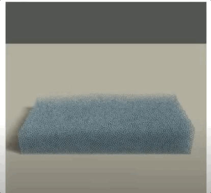

# Position Based Fluid Simulation
CSC417 Project \
Hanlin Zhou, Long Ji 

Demos require 64-bit Python3 and taichi library version 0.7.0.

Demos run on GPU (CUDA) by default. 
Can switch to CPU by changing "ti.init(arch=ti.gpu)" to "ti.init(arch=ti.cpu)".
\
# video explnation
https://youtu.be/yp1B_HC5wLo
# 2D Simulation:
-run Position_Based_Fluid.py \
-Press 'A' and 'D' to control fluid movement.
\

# 3D Simulation: (no realtime 3D visualization available)
-run PBF3D.py \
-Press 'A','D','W','S' to control fluid movement. \
-switching to cpu mode not recommended. \
-creates a sub-folder "./3d_ply" which stores outputs PLY files that can be rendered in other software. (Blender, Houdini) \
-comment out line 362-366 if you do not want the PLY outputs.
\

